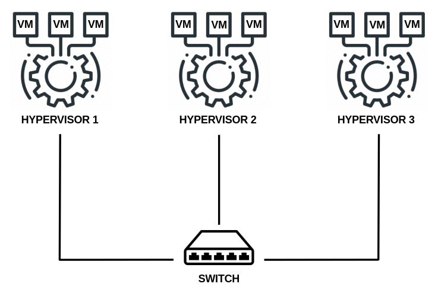

<!-- Copyright (C) 2020, RTE (http://www.rte-france.com) -->
<!-- Copyright (C) 2024, SFL (https://savoirfairelinux.com) -->
<!-- SPDX-License-Identifier: CC-BY-4.0 -->

# Ansible configuration
Configuring the cluster through ansible requires inventories and we recommand 3 kinds:
- The description of the machines that will form the cluster
- The description of the OpenVSwitch network
- The description of the virtual machines
In addition to this a file to configure the firewall rules for the cluster's network is needed

# Inventories directory

This is the place where you can store your inventories.
In this folder, different templates are provided:
- The cluster description inventory, where you will populate the details of your nodes (ip, interface, network details, disks, etc.): seapath_cluster_definition_example.yml
- The basic cluster inventory for POC: seapath_basic_cluster_definition_example.yml
- A standalone description inventory: seapath_standalone_definition_example
- The OpenVSwitch topology inventory, where you will describe the different bridges and ports configuration for OVS: seapath_ovstopology_definition_example.yml
- The VM inventory, where you will describe all variables related to the virtual machine (number of cores, features, ip, network interface, etc.): seapath_vm_definition_example.yml
- The firewall rules, where you will describe the packet filtering and the NAT on the system: iptables_rules_example.txt


## Optionnal variables

You can find concrete examples of the variables in the inventories of this directory. Below are optionnal advanced variables that are not described in the examples.

### Network implementation

```yaml
apply_network_config: true
# If set to true, the OVS and systemd-network configuration will be applied at runtime, without a reboot.
skip_reboot_setup_network: true
# If set to true, the reboot at the end of the network playbook will be skipped. This is useful in the CI to apply all changes done by ansible within the final reboot. However, it can lead to race conditions if the inventory is not handled correctly.
# It must be used with apply_network_config set to false, otherwise the reboot is already avoided.
skip_recreate_team0_config: true
# If set to true, the team0 ovs bridge of the cluster won't be destroyed and recreated by the network playbook.
remove_all_networkd_config: true
# If set to true, the network playbook will start by wiping the /etc/systemd/network/ directory content, this can help cleaning old conflicting files.
# THIS MUST NOT BE USED WITH skip_recreate_team0_config at the same time or the cluster network config won't be recreated.
```

## Basic cluster inventory

This inventory can be used with nucs as hypervisors and will use the public network to form the cluster



#### ⚠ Do not support ⚠

- Low latency network
- Dedicated cluster network with redundancy
- Advanced features like:
    - SNMP
    - Syslog log sending
    - Advanced isolation


#### Variables to be configured :
- ansible_host for each node (identical to the IP of the switch interface)
- ceph_osd_disk to locate the disk used
- (optionnal) data_size and device_size can be modified depending on the space left on the ceph_osd_disk
- gateway_addr
- dns_servers
- ntp_servers
- public_network
- admin_passwd
- admin_ssh_keys