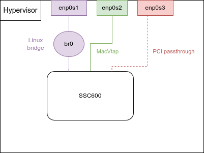

# ABB Inventory

This directory contains the example inventory files for the SSC600 SW from ABB. It can configure a standalone yocto hypervisor and a SSC600 SW VM.
The VM name must contain the string "ssc600" to be recognized by the qemu hook provided by ABB. (See the files needed section).
The VM deployment has been tested on a yocto and a debian hypervisor.

## Structure

- `ssc600_hypervisor_standalone_example.yaml`: The inventory for a standalone hypervisor
- `ssc600_vm_standalone_example.yaml`: The inventory for the SSC600 VM

## Files needed

Some files provided by ABB are needed to use these inventories:
- ssc600_disk.img.gz
- qemu.hook

To use them, they can be copied in the `files` directory at the root of ansible.

> The raw image disk can be converted to qcow2 format. The disk_extract variable has to be set to false.

## Prerequisite

The VM need at least 30GB of free space. Ansible deploy it in the /var/lib/libvirt/images directory.
> Make sure to have free 30GB on /var/lib directory

## Example architecture

The example inventories have been created to run the SSC600 VM using 2 interfaces (on the figure):
- enp0s20f0u7: Ansible management, VM HMI, PTP
- enp88s0: SVs

The default br0 bridge is use.

## Cache L3 partitioning

The L3 cache partitioning is not supported and would need to be tested with and without to see the impact.